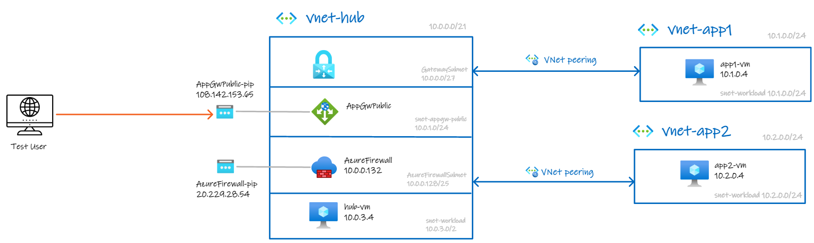

### [<< BACK TO THE MAIN MENU](https://github.com/dawlysd/azure-application-gateway-microhack)

# Prerequisites

## Overview

To achieve all of the MicroHack scenarios, let's deploy this basic infrastructure:

> Application Gateway public IP and Azure Firewall public IP will not be the same in your environment: you will have to adapt your tests.
> 
> Virtual machines private IPs will be the same as those indicated on the diagram.
>
> A web server is installed on all the machines in the diagram, listening on port :80 with a default page indicating the name of the machine.

## Task 1: Deploy Templates

To start the Terraform deployment, follow the steps listed below:

- Login to Azure Cloud shell [https://shell.azure.com/](https://shell.azure.com/)
- Ensure that you are operating within the correct subscription via:

`az account show`

- Clone the current GitHub repository 

`git clone https://github.com/dawlysd/azure-application-gateway-microhack`

- Go to the new folder *azure-application-gateway-microhack/* and initialize the terraform modules

`cd azure-application-gateway-microhack/templates`

`terraform init`

- Now run apply to start the deployment 

`terraform apply`

- Choose a suitable password to be used for your Virtual Machines administrator account (username: adminuser)

- When prompted, confirm with a **yes** to start the deployment

- Wait for the deployment to complete. This will take around 15 minutes (Application Gateway & Azure Firewall provisionning takes a while).

## Task 2: Explore and verify the deployed resources

* Verify you can access via Serial Console:
  * app1-vm in app1-rg
  * app2-vm in app2-rg
  * hub-vm in hub-rg
* Verify VNet peering status between hub-vnet and app1-vnet 
* Verify VNet peering status between hub-vnet and app2-vnet

## 🏁 Results
* You have deployed the basic infrastructure required to continue this MicroHack
* You have become familiar with the components you have deployed in your subscription
* You are now able to login to all VMs using your specified credentials via Serial Console

### [>> GO TO SCENARIO #1](https://github.com/dawlysd/azure-application-gateway-microhack/blob/main/1-scenario.md) 

