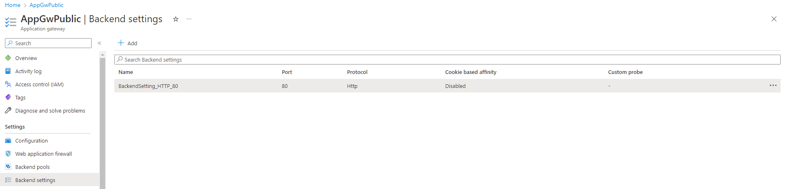

### [<< BACK TO THE MAIN MENU](https://github.com/dawlysd/azure-application-gateway-microhack)

# Scenario #1: Expose app1-vm website on to the Internet

During the infrastructure deployment with Terraform, several settings in Application Gateway were configured. Let's play with these settings!

## Overview

`app1-vm` machine is running a HTTP webserver listening on port :80 privately.

Let's expose this private webserver on to the Internet through Application Gateway:

> In this MicroHack, Application Gateway will have a single public IP address. 

## Task 1: Understand Application Gateway components model

To distribute traffic, an Application Gateway uses several components :

Review [the documentation](https://learn.microsoft.com/en-us/azure/application-gateway/application-gateway-components) if you need to deep-dive on this model.

During the infrastructure deployment, some of these components were already configured to expose `app1-vm` for the first scenario only. Let's review them!

## Task 2: Review Frontend IP configurations

> Frontend IP configurations define the IP address used by Application Gateway to receive incoming HTTP(S) requests.
>
> Application Gateway can have at most one public ip and one private ip configured, no more.

Navigate to AppGwPublic => Settings => Frontend IP configurations:

At this scenario #1 step, **only the Public Frontend IP is configured**:
* With the Public IP address 108.142.153.65 (AppGwPublic-pip)
  * The IP address will not be the same in your environment, adapt your tests.
* With the listener Listener-Public-Http_app1

## Task 3: Review Listeners

> Listeners listen for requests received on the Frontend IP they are associated with, on a specific port and protocol. There are [two types of listeners](https://learn.microsoft.com/en-us/azure/application-gateway/application-gateway-components#types-of-listeners):
> * Basic listener: process all requests hitting the associated Frontend IP and matching their configured port and protocol
> * Multi-site listeners: process all requests hitting the associated Frontend IP and matching their configured port and protocol and **hostname**.

Navigate to AppGwPublic => Settings => Listeners:

All requests hitting the FrontendIP Public on HTTP:80 will be routed by `RoutingRule_app1` routing rule.

## Task 4: Review Routing Rules

> Routing Rules forward requests processed by a Listener to the backends or redirects them elsewhere. There are [two types of Routing Rules](https://learn.microsoft.com/en-us/azure/application-gateway/application-gateway-components#request-routing-rules):
> * Basic: all requests are forwarded to the associated backend pool 
> * Path-based: route the requests to a specific backend pool based on the URL in the request

> Routing Rules is associated to a "Backend setting", which defines how to connect to backend pool (port, protocol, ...)

Navigate to AppGwPublic => Settings => Rules:

`RoutingRule_app1` forwards requests coming from `Listener-Public-Http_app1` to `BackendPool-app1` with `BackendSetting_HTTP_80` configuration.

## Task 5: Review Backend pools

> Backend pool is a collection of resources to which your application gateway can send traffic. A backend pool can contain virtual machines, virtual machines scale sets, IP addresses, domain names, or an App Service.
> 
> Round-robin load balancing method is used across all the backend servers

Navigate to AppGwPublic => Settings => Backend pools:

`BackendPool-app1` contains only one IP address: `10.1.0.4` which is IP address of `app1-vm` machine.

## Task 6: Review Backend settings

> Backend settings define how to connect to backend pool instances to forward requests: Backend protocol, Backend port, Session-affinity, Connection draining, Custom probe, ...

Navigate to AppGwPublic => Settings => Backend settings:

## Task 7: Check it works

Navigate to http://AppGwPublic-pip. Replace `AppGwPublic-pip` by the value of the Public IP.

Result: ✅

## 🏁 Results

You should now be more familiar with all of the concepts and components around Application Gateway.

Let's now expose multiple websites with Scenario #2.

### [>> GO TO SCENARIO #2](https://github.com/dawlysd/azure-application-gateway-microhack/blob/main/2-scenario.md)

