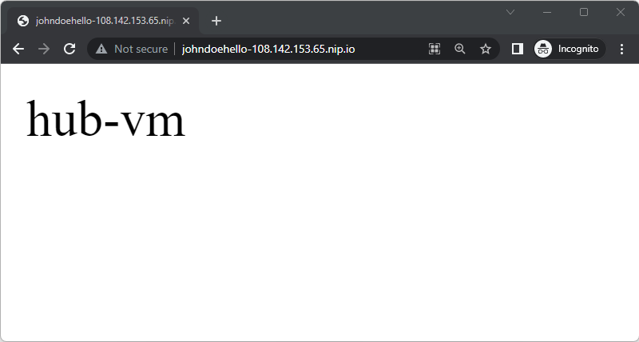
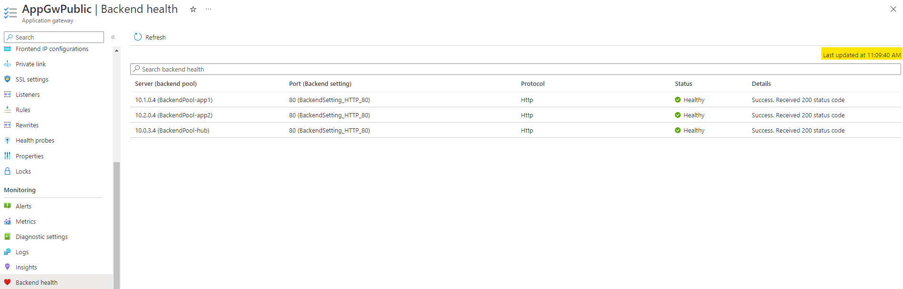

### [<< BACK TO THE MAIN MENU](https://github.com/dawlysd/azure-application-gateway-microhack)

# Scenario #2: Mutualize Application Gateway and expose multiple websites

## Overview

Let's expose 3 different websites on Application Gateway
1) http://108.142.153.65/ will serve traffic to `hub-vm` website
2) http://app1-108.142.153.65.nip.io/ will serve traffic to  `app1-vm` website
3) http://app2-108.142.153.65.nip.io/ will serve traffic to `app2-vm` website

> [nip.io](https://nip.io/) is a service that maps `<anything>[.-]<IP Address>.nip.io` in **"dot"**, **"dash"** or **"hexadecimal"** notation to the corresponding **<IP Address>**.

Diagram:

## Task 1: Create Backend pools

Create below Backend pools:
* `BackendPool-hub` with Backend target IP address of hub-vm `10.0.3.4`
* `BackendPool-app2` with Backend target IP address of app2-vm `10.2.0.4`

Keep `BackendPool-app1` created previously on scenario #1:

## Task 2: Create Listeners

**Update** `Listener-Public-Http_app1`:
* Set "Listener type" to Multi site
* Set "Host type" to Single
* Set "Host name" to `app1-108.142.153.65.nip.io`

**Create** `Listener-Public-Http_app2`:
* Set "Listener type" to Multi site
* Set "Host type" to Single
* Set "Host name" to `app2-108.142.153.65.nip.io`

**Create** `Listener-Public-Http_hub`:
* Set "Listener type" to Basic

## Task3: Create Routing Rules

**Create** ``RoutingRule_app2``:
* Priority: 101
* Listener: `Listener-Public-Http_app2` 
* Backend targets
  * Target type: Backend pool
  * Backend target: `BackendPool-app2`
  * Backend settings: `BackendSetting_HTTP_80`

**Create** ``RoutingRule_hub``:
* Priority: 102
* Listener: `Listener-Public-Http_hub` 
* Backend targets
  * Target type: Backend pool
  * Backend target: `BackendPool-hub`
  * Backend settings: `BackendSetting_HTTP_80`

## Task4: Check it works

1) Navigate to http://108.142.153.65/ 

Expected result: 

2) Navigate to http://app1-108.142.153.65.nip.io/ 

Expected result: 

3) Navigate to http://app2-108.142.153.65.nip.io/ 

Expected result: 

## Task 5: Multi site Listener & wildcard in hostname

> Application Gateway allows host-based routing using [multi-site HTTP(S) listener](https://learn.microsoft.com/en-us/azure/application-gateway/multiple-site-overview#wildcard-host-names-in-listener) and wildcard characters like asterisk (*) and question mark (?) in the host name.

**Create** `Listener-Public-Http_johndoe`:
* Set "Listener type" to Multi site
* Set "Host type" to Multiple/Wildcard
* Set "Host name" to `johndoe*-108.142.153.65.nip.io`

**Create** ``RoutingRule_johndoe``:
* Priority: 103
* Listener: `Listener-Public-Http_johndoe` 
* Backend targets
  * Target type: Backend pool
  * Backend target: `BackendPool-hub`
  * Backend settings: `BackendSetting_HTTP_80`

**Check it works**:
* Navigate to http://johndoehello-108.142.153.65.nip.io/
* Navigate to http://johndoe42-108.142.153.65.nip.io/

Expected result:

## Task 6: (Monitoring) Review Application gateway Insights

Navigate to Monitoring => Insights:

This page allows you to summarize the Application Gateway configuration in a graphical view and potentially see backends that would not be considered healthy.

## Task 7: (Monitoring) Review Backend health

Navigate to Monitoring => Backend health

This page allows to have more detail on the state of the backends, even if the state is not "instantaneous".

Note that it is possible to define [custom probes](https://learn.microsoft.com/en-us/azure/application-gateway/application-gateway-create-probe-portal) on Application Gateway.

## 🏁 Results

You should now be more familial with the mutualization of Application Gateway.

During this scenario, [redirection](https://learn.microsoft.com/en-us/azure/application-gateway/redirect-overview) feature has not been practiced. This feature is commonly used to redirect traffic from HTTP Listener to HTTPS Listener in Routing Rule.

Let's now add some security and play with Web Application Firewall on Application Gateway with Scenario #3.

### [>> GO TO SCENARIO #3](https://github.com/dawlysd/azure-application-gateway-microhack/blob/main/3-scenario.md)
