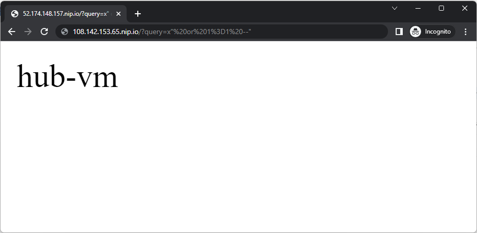

### [<< BACK TO THE MAIN MENU](https://github.com/dawlysd/azure-application-gateway-microhack)

# Scenario #3: Configure Web Application Firewall

## Introduction 

Web Application Firewall **helps protect your web applications from common threats** such as SQL injection, cross-site scripting, and other web exploits. You can define a WAF policy consisting of a combination of custom and managed rules to control access to your web applications.

When a WAF policy is created, it must be associated to an application gateway to take effect. It can be associated with any combination of application gateways, listeners, and path-based rules.

## Overview

Let's create one Waf Policy per Listener:

## Task 1: Change Application Gateway tier

During the infrastructure deployment with Terraform, Application Gateway was deployed with `Standard V2` tier.

**Change** the tier to `WAF V2` and **Save**:

## Task 2: Create WAF Policies

To create WAF Policies, the easiest way is to go to Marketplace and search `Web Application Firewall`:

**Create** the first `AppGwPublic-WafPolicy_Default` Waf policy:

Keep "Managed rules", "Policy settings" and "Custom rules" with default proposed configuration.

**Associate** this WAF policy to `Listener-Public-Http_hub` and `Listener-Public-Http_johndoe` listeners:

**Skip** Tags and **Create** this first WAF policy.

**Create** two others WAF policy:
1) `AppGw-WafPolicy-app1`
   * Policy mode: `Prevention`
   * Associated Listener: `Listener-Public-Http_app1`
2) `AppGw-WafPolicy-app2`
   * Policy mode: `Prevention`
   * Associated Listener: `Listener-Public-Http_app2`

## Task 3: Associate `AppGwPublic-WafPolicy_Default` to `AppGwPublic` Application Gateway

**Navigate** to `AppGwPublic-WafPolicy_Default` WAF Policy and **display** Associated application gateways:

This `AppGwPublic-WafPolicy_Default` WAF policy is associated to `Listener-Public-Http_hub` and `Listener-Public-Http_johndoe`.

In addition, **associate** `AppGwPublic-WafPolicy_Default` WAF policy to `AppGwPublic` Application Gateway itself to make sure that future Listeners will also be protected:

## Task 4: Check it works

1) Navigate to [http://108.142.153.65.nip.io/?query=x"%20or%201%3D1%20--"](http://108.142.153.65.nip.io/?query=x"%20or%201%3D1%20--")

Expected result: 

`WafPolicy_Default` is not blocking us as it is configured in **Detection mode**.

2) Navigate to [http://app1-108.142.153.65.nip.io/?query=x"%20or%201%3D1%20--"](http://app1-108.142.153.65.nip.io/?query=x"%20or%201%3D1%20--")

Expected result: 

`AppGw-WafPolicy-app1` is blocking us as it is configured in **Prevention mode**.

3) Navigate to [http://app2-108.142.153.65.nip.io/?query=x"%20or%201%3D1%20--"](http://app2-108.142.153.65.nip.io/?query=x"%20or%201%3D1%20--")

Expected result: 

`AppGw-WafPolicy-app2` is blocking us as it is configured in **Prevention mode**.

## Task 5: Monitor WAF

[Enabling logging](https://learn.microsoft.com/en-us/azure/web-application-firewall/ag/web-application-firewall-logs#enable-logging-through-the-azure-portal) for Application Gateway allows to query logs and displays when WAF matches a rule:

[Integration with Microsoft Sentinel](https://learn.microsoft.com/en-us/azure/web-application-firewall/ag/best-practices#send-logs-to-microsoft-sentinel) (SIEM) is possible and recommended.

[WAF Metrics](https://learn.microsoft.com/en-us/azure/web-application-firewall/ag/application-gateway-waf-metrics#access-waf-metrics-in-azure-portal) are available by default in Azure portal.

## 🏁 Results

You should now be more familial with [**Global WAF policy**](https://learn.microsoft.com/en-us/azure/web-application-firewall/ag/policy-overview#global-waf-policy) and [**Per-site WAF policy**](https://learn.microsoft.com/en-us/azure/web-application-firewall/ag/policy-overview#per-site-waf-policy). It is also possible to configure [Per-URI policy](https://learn.microsoft.com/en-us/azure/web-application-firewall/ag/policy-overview#per-uri-policy).

If you deploy Application Gateway in production, make sur you follow [best practices](https://learn.microsoft.com/en-us/azure/web-application-firewall/ag/best-practices).

Let's now inspect network traffic between Application Gateway and VMs, with Azure Firewall.

### [>> GO TO SCENARIO #4](https://github.com/dawlysd/azure-application-gateway-microhack/blob/main/4-scenario.md)
