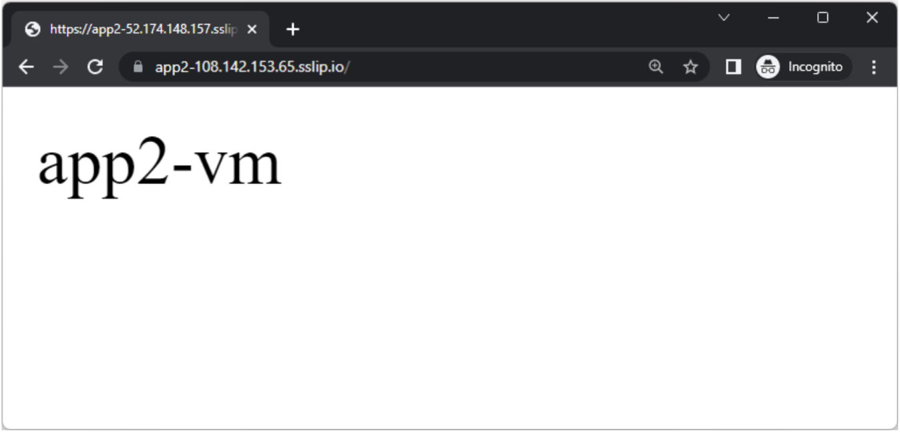

### [<< BACK TO THE MAIN MENU](https://github.com/dawlysd/azure-application-gateway-microhack)

# Scenario #5: Expose HTTPS websites using Let's Encrypt

## Overview

Let's will expose `app2-vm` web application through Application Gateway by playing with Let's encrypt & HTTPS Listeners: 


> Note: `app2` FQDN has changed from `app2-108.142.153.65.nip.io` to `app2-108.142.153.65.sslip.io`.
> 
> [sslip.io](https://sslip.io/) provides the same service as [nip.io](https://nip.io/). 
> 
> I changed only because when I was writting this Microhack, I had the Let's encrypt error `too many certificates already issued for "nip.io"`.

## Introduction - Let's Encrypt

To enable HTTPS on your website, you need to get a certificate (a type of file) from a Certificate Authority (CA). Let’s Encrypt is a CA.

In order to get a certificate for your website’s domain from Let’s Encrypt, you have to demonstrate control over the domain. With Let’s Encrypt, you do this using software that uses the ACME protocol which typically runs on your web host.

In this scenario, we'll install `certbot` CLI to manualy generate certificate and upload it to Application Gateway.

## Prerequisites:

Two tools are required to generate Let's Encrypt certificates:
1) [Certbot](https://certbot.eff.org/): Certbot is a free, open source software tool for automatically using Let’s Encrypt certificates on manually-administrated websites to enable HTTPS.
2) [OpenSSL](https://www.openssl.org/): command line tool. OpenSSL is a robust, commercial-grade, and full-featured toolkit for the Transport Layer Security (TLS) and Secure Sockets Layer (SSL) protocols. It is also a general-purpose cryptography library.

For Windows Users using Windows Terminal & Ubuntu shell:
  * **Install** Certbot: `sudo apt install certbot -y`
  * **Install** OpenSSL: `sudo apt install openssl -y`

## Task 1: Update `Listener-Public-Http_app2` listener

**Update** `Listener-Public-Http_app2` to support old and new hostnames:


## Task 2: Generate certificate

1) Open Windows Terminal => Ubuntu machine
2) **Switch** to root user: `$ sudo su -`
3) **Request** certificate: `$ certbot certonly -d app2-108.142.153.65.sslip.io --manual`


4) **Connect** to `app2-vm` through Serial Console. *Enable boot diagnostics with managed storage account if needed*


5) Through Serial Console, create requested file:

```bash
# Become root
$ sudo su - 

# Create required folders
$ mkdir -p /var/www/html/.well-known/acme-challenge/

# Create challenge file
$ echo "MJSPWS778d9pWLXeSWVFI1BHf5TJzuyVJurQ7EFIFRk.qcBdGrwO-x8t4XtJX89Ga3x5RN7rWqrD3qnJGfpInho" > /var/www/html/.well-known/acme-challenge/MJSPWS778d9pWLXeSWVFI1BHf5TJzuyVJurQ7EFIFRk
```

6) Come back to Windows Terminal and **Press** Enter:


The certificate is now generated and stored in `/etc/letsencrypt/live/app2-108.142.153.65.sslip.io/` folder.

7) Convert certificate to .pfx 

**.pfx** certificate format is required by Application Gateway. Let's generate it:

```bash
$ cd /etc/letsencrypt/live/app2-108.142.153.65.sslip.io/

$ openssl pkcs12 -export -out app2-108.142.153.65.sslip.io.pfx -inkey privkey.pem -in fullchain.pem
Enter Export Password:
Verifying - Enter Export Password:
```
> **Important**: do not put an empty password! This is not supported later by Application Gateway


**Copy** `app2-108.142.153.65.sslip.io.pfx` certicate to your Desktop: `cp app2-108.142.153.65.sslip.io.pfx /mnt/c/Users/dasantiago/Desktop/`. **Replace `dasantiago` by your username.**

## Task 3: Create HTTPS Listener

Create `Listener-Public-Https-app2` listener:


## Task 4: Create new Routing Rule

Create `RoutingRule_app2_https` routing rule:
* Priority: 104
* Listener: `Listener-Public-Https-app2` 
* Backend targets
  * Target type: `Backend pool`
  * Backend target: `BackendPool-app2`
  * Backend settings: `BackendSetting_HTTP_80`

## Task 5: Check it works!

* Navigate to https://app2-108.142.153.65.sslip.io/

Expected result:



## Task 6: Configure HTTP redicection to HTTPs

**Update** `RoutingRule_app2` routing rule to Redirect to HTTPS listener: 


**Navigate** to http://app2-108.142.153.65.sslip.io/, you should be automatically redirect to https://app2-108.142.153.65.sslip.io/ 😀

## 🏁 Results

You should now be more familial with HTTPS Listeners.

The most complicated part here was to generate the certificates by hand with certbot to upload them to Application Gateway with these weird FQDNs.

In real life, certificates are either:
* [uploaded manually in a KeyVault](https://learn.microsoft.com/en-us/azure/key-vault/certificates/tutorial-import-certificate?tabs=azure-portal). The Gateway application will look for the certificates in KeyVault
* or [generated by the Keyvault](https://learn.microsoft.com/en-us/azure/key-vault/certificates/how-to-integrate-certificate-authority) with DigiCert or GlobalSign.

Some alternatives exist: rely on Let's Encrypt and [automate SSL renewal on Application Gateway](https://intelequia.com/blog/post/1012/automating-azure-application-gateway-ssl-certificate-renewals-with-let-s-encrypt-and-azure-automation).


Let's now use HTTPS backend servers!


### [>> GO TO SCENARIO #6](https://github.com/dawlysd/azure-application-gateway-microhack/blob/main/6-scenario.md)