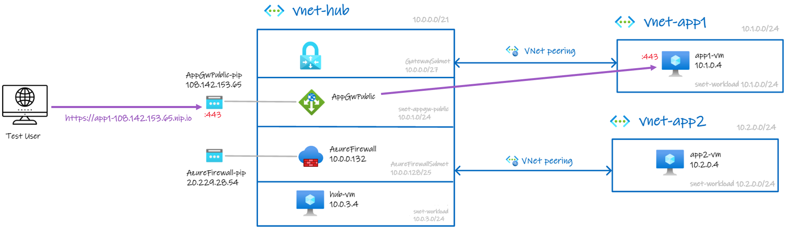
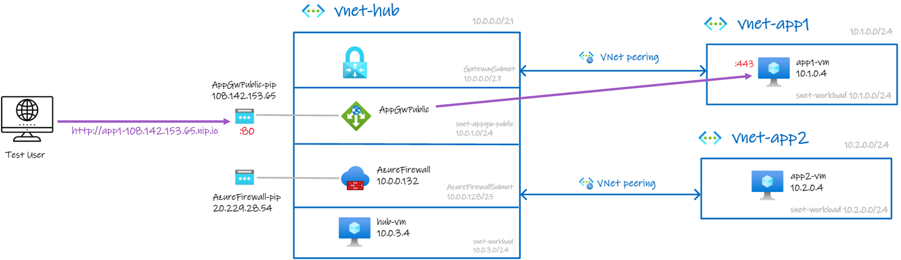
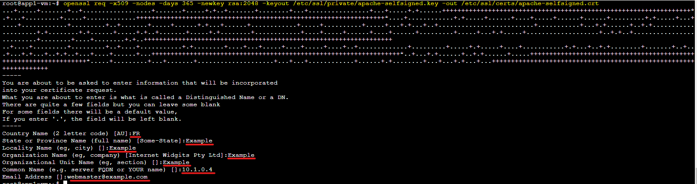
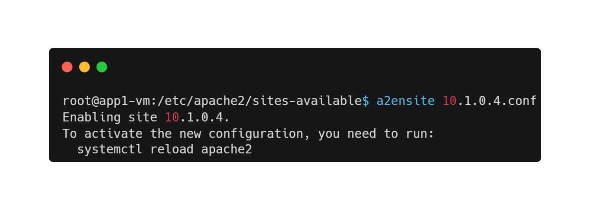
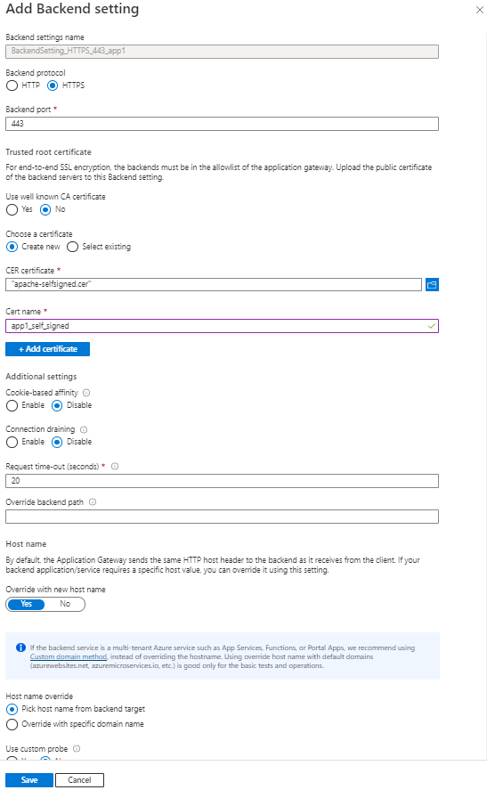
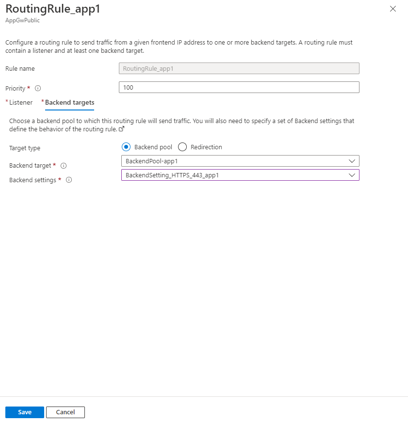

### [<< BACK TO THE MAIN MENU](https://github.com/dawlysd/azure-application-gateway-microhack)

# Scenario #6: Support HTTPS backend servers

## Introduction

Until now, the communication between Application Gateway and backend servers was uncrypted. 

Even if it has [several advantages](https://learn.microsoft.com/en-us/azure/application-gateway/ssl-overview#tls-termination), there may be security requirements imposing the [end-to-end TLS encryption](https://learn.microsoft.com/en-us/azure/application-gateway/ssl-overview#end-to-end-tls-encryption):




## Overview 

To keep this scenario independent of [Scenario #5](https://github.com/dawlysd/azure-application-gateway-microhack/blob/main/5-scenario.md), Test User will access to app2-vm webapp through **HTTP**: http://app1-108.142.153.65.nip.io.  



Let's configure:
- `app1-vm` to expose its website in HTTPs with a self-signed certificate
- Application Gateway Backend settings to take into account the new configuration of app1-vm.

This scenario use a self-signed certificate to review required steps in the context where backend servers would have private PKI signed certificates that need to be accessible from Application Gateway.

> If the backend certificates are issued by a well known CA, task 1 is useless, go directly to [Task2](https://github.com/dawlysd/azure-application-gateway-microhack/blob/main/6-scenario.md#task-2-create-backendsetting_https_443_app1) and check "Use well known CA certificate".

## Task 1: Generate self-signed certificate on `app1-vm`

**Connect** to `app1-vm` through Serial Console. *Enable boot diagnostics with managed storage account if needed*

* Enable `mod_ssl`
  
```bash
# Become root
sudo su - 

# Update packages
apt update -y && apt upgrade -y

# Enable Apache mod_ssl
a2enmod ssl
# Restart apache2
systemctl restart apache2
```

* Create the SSL Certificate

```bash
openssl req -x509 -nodes -days 365 -newkey rsa:2048 -keyout /etc/ssl/private/apache-selfsigned.key -out /etc/ssl/certs/apache-selfsigned.crt
```



* Configure Apache to Use SSL

```bash
cd /etc/apache2/sites-available/
vi 10.1.0.4.conf
```

**Paste** below configuration:
```
<VirtualHost *:443>
   ServerName 10.1.0.4
   DocumentRoot /var/www/html/

   SSLEngine on
   SSLCertificateFile /etc/ssl/certs/apache-selfsigned.crt
   SSLCertificateKeyFile /etc/ssl/private/apache-selfsigned.key
</VirtualHost>
```

**Save** and **close** the file.

**Enable** the configuration:
```bash
a2ensite 10.1.0.4.conf
```



**Check** apache2 configuration:
```bash
apache2ctl configtest
```

**Reload** apache2:
```bash
systemctl reload apache2
```

**Check** apache2 is listening & working on HTTPs:
```bash
# Normal curl
curl https://10.1.0.4
curl: (60) SSL certificate problem: self-signed certificate
More details here: https://curl.se/docs/sslcerts.html

curl failed to verify the legitimacy of the server and therefore could not
establish a secure connection to it. To learn more about this situation and
how to fix it, please visit the web page mentioned above.

# curl with insecure
curl -k https://10.1.0.4
app1-vm
```

The first curl fails and it is normal: given certificate is self-signed (not issued by a well known CA).

**Download** `/etc/ssl/certs/apache-selfsigned.crt` in your workstation and rename it to `apache-selfsigned.crt`. This certificate will need to be given to Application Gateway.

## Task 2: Create `BackendSetting_HTTPS_443_app1` 

In this new Backend Settings dedicated to app1, it is required to upload `apache-selfsigned.cer` downloaded previously :



**Important**: Host name must be overrided because Application Gateway need to "Pick host name from backend target" (aka private IP on which certificate was issued). Health probing will fail otherwise.

**Note**: In this MicroHack, we pick host name from backend target is a **bad practice**. Recommendation is to [Preserve the original HTTP host name between a reverse proxy and its back-end web application](https://learn.microsoft.com/en-us/azure/architecture/best-practices/host-name-preservation).

## Task 3: Update `RoutingRule_app1`

**Change** Backend settings to `BackendSetting_HTTPS_443_app1`:



## Task 4: Check it works!

Navigate to http://app1-108.142.153.65.nip.io/ 

Expected result: 


## 🏁 Results

You should now be more familiar with usage of backend servers with self-signed certificates.

In a corporate context, **it would have been necessary to import an intermediate or root certificate to Application Gateway** to avoid importing per-application certificates.

By combining this scenario with Scenario #4, it is possible to achieve End-to-end TLS.


### [>> GO TO SCENARIO #7](https://github.com/dawlysd/azure-application-gateway-microhack/blob/main/7-scenario.md)
