### [<< BACK TO THE MAIN MENU](https://github.com/dawlysd/azure-application-gateway-microhack)

# Scenario #7: Expose App service through Application Gateway

## Overview

Let's create a public App Service, and restrict its access through Application Gateway: 
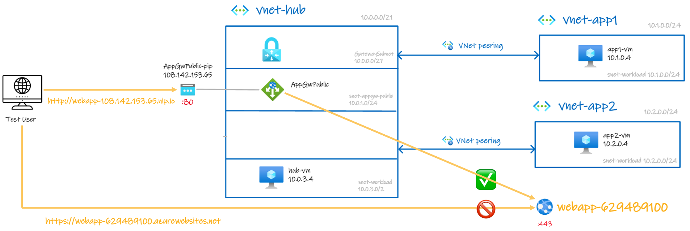

## Task 1: Create App Service

- Login to Azure Cloud shell [https://shell.azure.com/](https://shell.azure.com/)
- Execute below commands

```bash
# Variable block
let "randomIdentifier=$RANDOM*$RANDOM"
resourceGroup="appservice-rg"
location="westeurope"
appServicePlan="appsp-$randomIdentifier"
webapp="webapp-$randomIdentifier"

# Create a resource group.
echo "Creating $resourceGroup in "$location"..."
az group create --name $resourceGroup --location $location

# Create an App Service plan in `FREE` tier.
echo "Creating $appServicePlan"
az appservice plan create --name $appServicePlan --resource-group $resourceGroup --sku FREE

# Create a web app.
echo "Creating $webapp"
az webapp create --name $webapp --resource-group $resourceGroup --plan $appServicePlan

## Display URL
echo "Web App URL: https://webapp-$randomIdentifier.azurewebsites.net"
```

Navigate to WebApp URL:

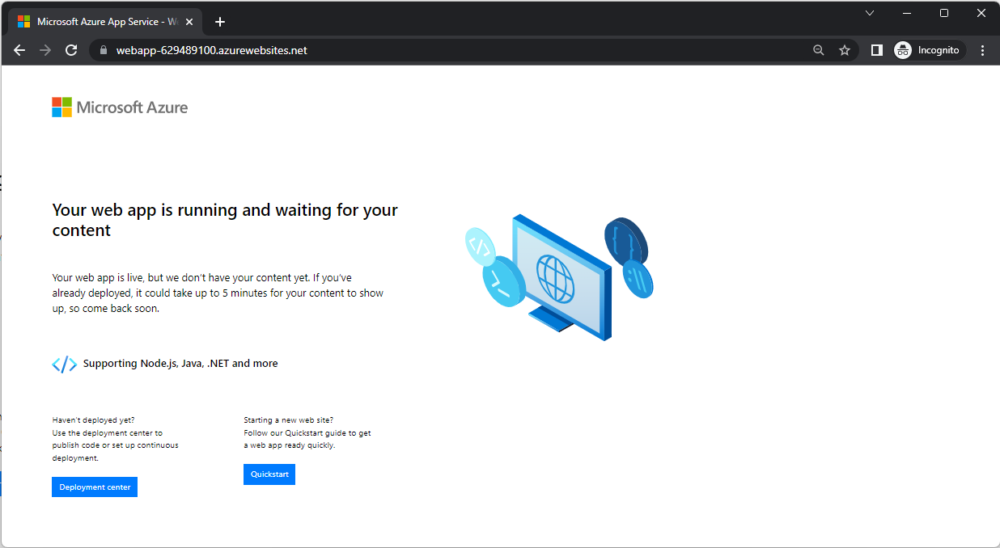

Let's keep this default web page and expose it through Application Gateway

## Task 2: Create `BackendPool-appservice`

**Create** Backend pool`BackendPool-appservice` with Backend Target FQDN of appservice `webapp-629489100.azurewebsites.net`

> It is possible to use "Target type" `App Services` if the App Service is deployed in the same subscription than Application Gateway.

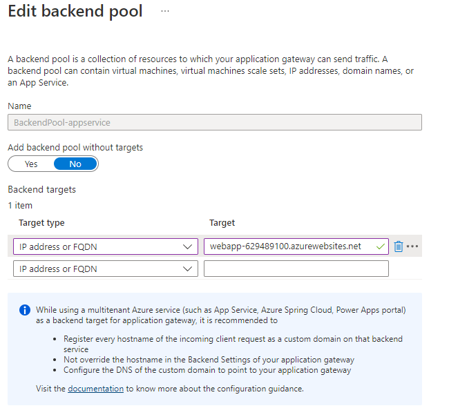

## Task 3: Create App Service Listener in AppGw

**Create** `Listener-Public-Http_appservice`:
* Set "Listener type" to Multi site
* Set "Host type" to Single
* Set "Host name" to `appservice-108.142.153.65.nip.io`

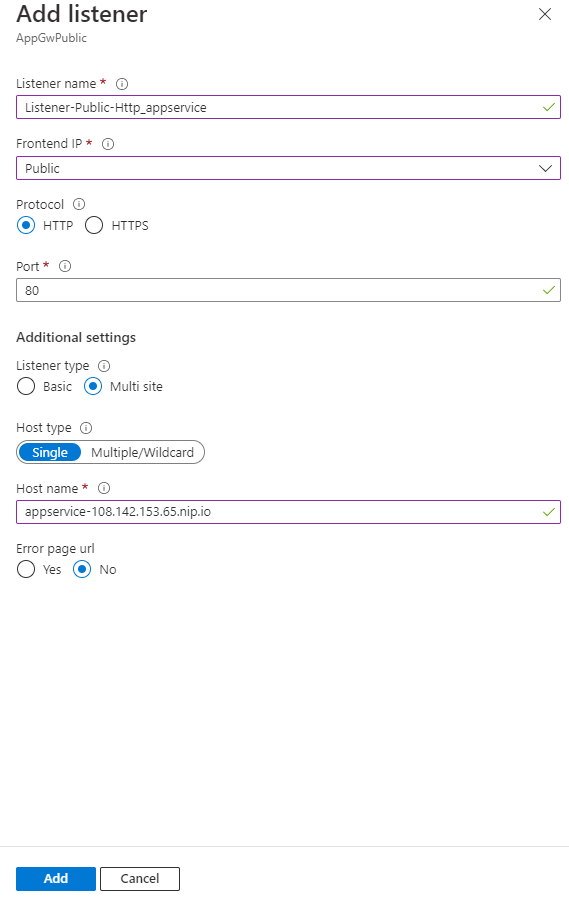

## Task 3: Create `BackendSetting_HTTP_443`

**Create** `BackendSetting_HTTP_443_appservice`:
* Backend protocol: `HTTPS`
* Backend port: `443`
* Use well known CA certificate: `Yes`
* Override with new host name: `Yes`
* Host name override: `Pick host name from backend target`


**Note**: In this MicroHack, we pick host name from backend target is a **bad practice**. Recommendation is to [Preserve the original HTTP host name between a reverse proxy and its back-end web application](https://learn.microsoft.com/en-us/azure/architecture/best-practices/host-name-preservation).

## Task 4: Create App Service Routing Rule in AppGw

**Create** ``RoutingRule_appservice``:
* Priority: 106
* Listener: `Listener-Public-Http_appservice` 
* Backend targets
  * Target type: Backend pool
  * Backend target: `BackendPool-appservice`
  * Backend settings: `BackendSetting_HTTP_443_appservice`

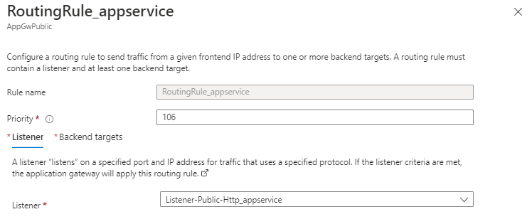

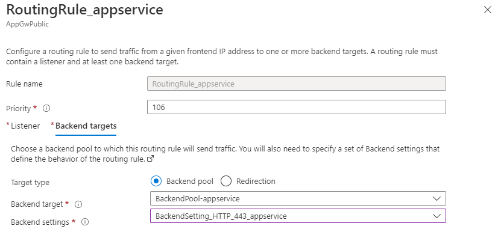

## Task 5: Check it works!

* Navigate to http://appservice-108.142.153.65.nip.io

Expected result: 
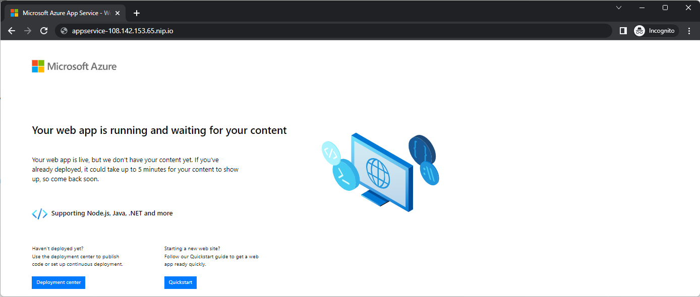

* Navigate to https://webapp-629489100.azurewebsites.net/

Expected result:


Let's restrict access to App Service from Application Gateway only!

## Task 6: Restrict access to App Service from Application Gateway only

In `appservice-rg`, go to Web App => Networking => Access restriction:

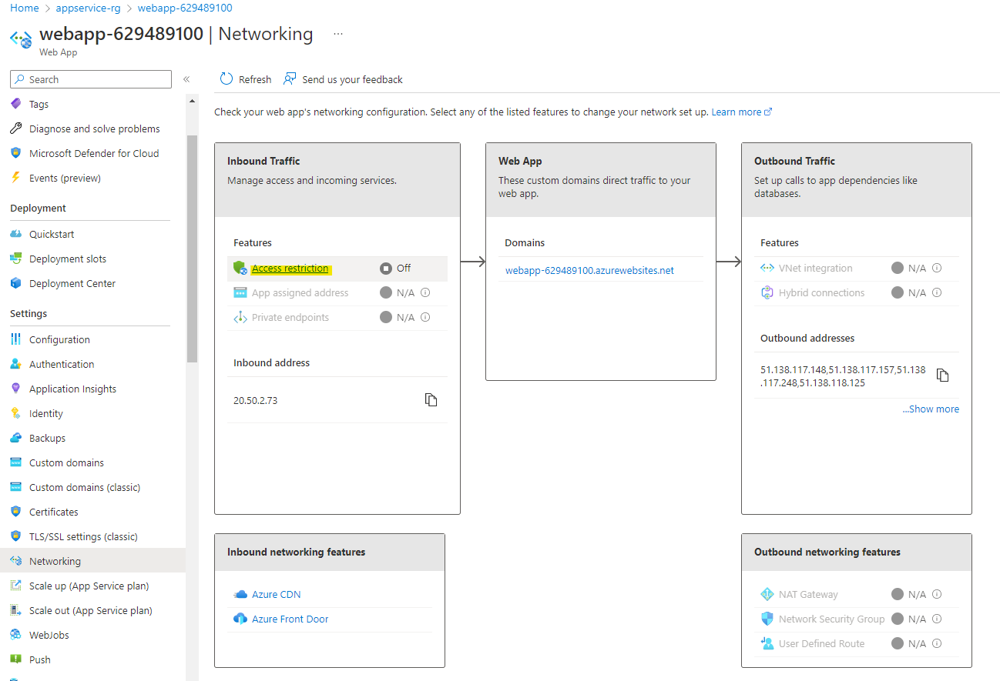

**Configure** Access Restriction to:
* Allow public access traffic
* Deny traffic for unmatched rule 

**Create** an `Allow_AppGw_Only` rule to allow traffic coming from Application Gateway Subnet:

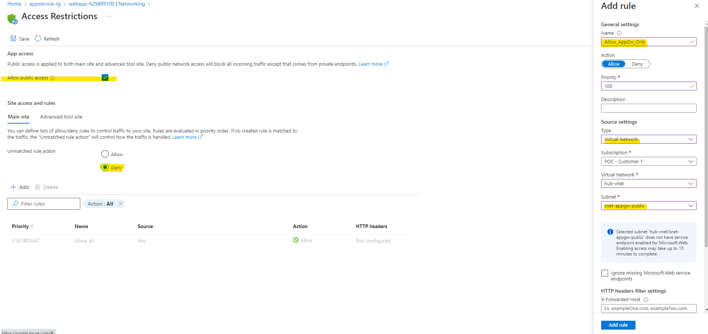

**Save**:

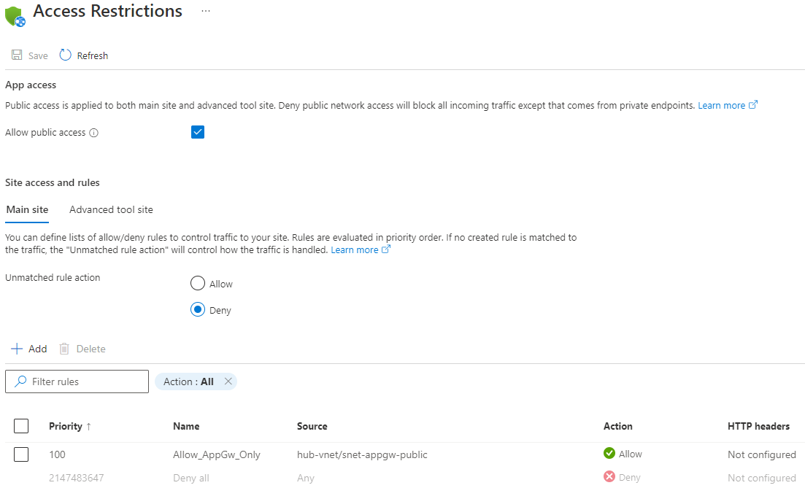


## Task 7: Check it works!

* Navigate to http://appservice-108.142.153.65.nip.io

Expected result: 


* Navigate to https://webapp-629489100.azurewebsites.net/

Expected result:
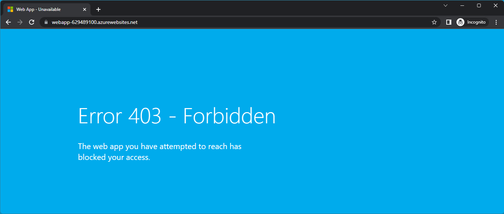

## 🏁 Results

You should now be more familiar with usage of Application Gateway & Azure App Service.

Do not hesitate to review best practice around [Preserving the original HTTP host name between a reverse proxy and its back-end web application](https://learn.microsoft.com/en-us/azure/architecture/best-practices/host-name-preservation)

### [<< BACK TO THE MAIN MENU](https://github.com/dawlysd/azure-application-gateway-microhack)