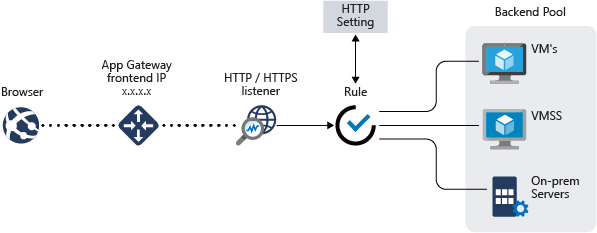
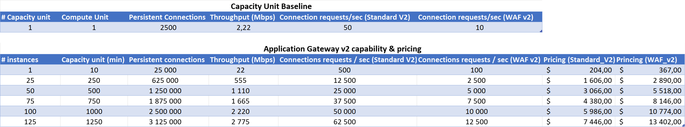
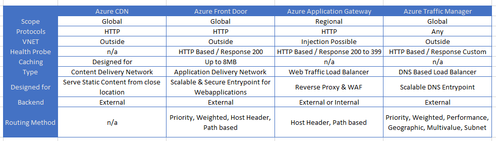

# Azure Application Gateway - MicroHack

# Introduction

[Azure Application Gateway](https://learn.microsoft.com/en-us/azure/application-gateway/overview) is a managed regional reverse proxy with optional WAF (Web Application Firewall) capibility used to expose web applications:

The intent of this MicroHack is to play with several [Application Gateway features](https://learn.microsoft.com/en-us/azure/application-gateway/features) through different scenarios.

# Scenarios

All scenarios except #1 and #2 can be done independently.

- [Prerequisites](https://github.com/dawlysd/azure-application-gateway-microhack/blob/main/0-prerequisites.md)

- [Scenario #1: Expose app1-vm website on to the Internet](https://github.com/dawlysd/azure-application-gateway-microhack/blob/main/1-scenario.md)

- [Scenario #2: Mutualize Application Gateway and expose multiple websites](https://github.com/dawlysd/azure-application-gateway-microhack/blob/main/2-scenario.md)

- [Scenario #3: Configure Web Application Firewall](https://github.com/dawlysd/azure-application-gateway-microhack/blob/main/3-scenario.md) 

- [Scenario #4: Inspect traffic with Azure Firewall](https://github.com/dawlysd/azure-application-gateway-microhack/blob/main/4-scenario.md)

- [Scenario #5: Expose HTTPS websites using Let's Encrypt](https://github.com/dawlysd/azure-application-gateway-microhack/blob/main/5-scenario.md)

- [Scenario #6: Support HTTPS backend servers](https://github.com/dawlysd/azure-application-gateway-microhack/blob/main/6-scenario.md)

- [Scenario #7: Expose App service through Application Gateway](https://github.com/dawlysd/azure-application-gateway-microhack/blob/main/7-scenario.md)

# Appendix

- [Azure Application Gateway - MicroHack](#azure-application-gateway---microhack)
- [Introduction](#introduction)
- [Scenarios](#scenarios)
- [Appendix](#appendix)
  - [How to manage the same port for both public-facing and private facing listener limitation](#how-to-manage-the-same-port-for-both-public-facing-and-private-facing-listener-limitation)
  - [Where to deploy Application Gateway in a Hub \& Spoke topology](#where-to-deploy-application-gateway-in-a-hub--spoke-topology)
  - [How to calculate the number of Application Gateway instances](#how-to-calculate-the-number-of-application-gateway-instances)
  - [Azure Application Gateway vs Azure Front Door](#azure-application-gateway-vs-azure-front-door)

## How to manage the same port for both public-facing and private facing listener limitation

Application Gateway [cannot use the same port for both public & private listeners](https://learn.microsoft.com/en-us/azure/application-gateway/application-gateway-faq#can-i-use-the-same-port-for-both-public-facing-and-private-facing-listeners).

To address this limitation, it is common for organizations to deploy at least 2 Application Gateways: **one to carry public site exposure**, and **another to carry private site exposure**.

It is then the [limits](https://learn.microsoft.com/en-us/azure/azure-resource-manager/management/azure-subscription-service-limits#application-gateway-limits) (listeners, SSL certificates ...) that derive the number of Application Gateway that are deployed.

## Where to deploy Application Gateway in a Hub & Spoke topology

As seen during this MicroHack, Application Gateway is a component that **can be massively mutualized**, which optimizes costs.

Historically, Application Gateways were deployed in the Hub as infrastructure elements. This can lead to limitations if new Application Gateways are to be deployed because IP availabilies in hub-vnet: [recommended application gateway subnet size is /24](https://learn.microsoft.com/en-us/azure/application-gateway/configuration-infrastructure#size-of-the-subnet).

If a routing NVA is available in the hub (Azure Firewall, 3rd party FW), it is quite conceivable to deploy Application Gateways in spokes VNets as soon as you are comfortable with UDRs (as seen in [scenario #4](https://github.com/dawlysd/azure-application-gateway-microhack/blob/main/4-scenario.md)), to keep the symmetry of the routing.

## How to calculate the number of Application Gateway instances

My colleague [Cynthia Treger](https://github.com/cynthiatreger) published a [Scaling guide with Azure Application Gateway v2](https://github.com/cynthiatreger/scaling-app-gw-v2).

Based on this guide, we can produce this AppGw capabilities table:

**Note**: Pricing columns (generated on february 2023, east US region, 5GB Outbound Data Transfer baseline) may not be relevant when auto scaling feature is enabled.

## Azure Application Gateway vs Azure Front Door

There are several components that can be placed in front of a (web) application:

[Source](https://kvaes.wordpress.com/2020/04/13/azure-what-do-i-put-in-front-of-my-web-application/)

[Azure Architecture Center](https://learn.microsoft.com/en-us/azure/architecture/guide/technology-choices/load-balancing-overview#decision-tree-for-load-balancing-in-azure) provides an interesting decision tree:
